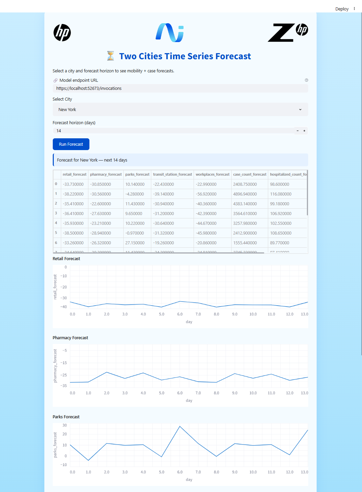

# 😷 Data Analysis with VAR

<div align="center">


</div>

## 📚 Contents

- [🧠 Overview](#overview)
- [🗂 Project Structure](#project-structure)
- [⚙️ Setup](#setup)
- [🚀 Usage](#usage)
- [📞 Contact and Support](#contact-and-support)

---

# Overview

This project explores a **regression** experiment using **mobility data** collected during the COVID-19 pandemic.

It highlights how city-level movement patterns changed during the crisis. The project runs on the **Data Science Workspace**.

---

# Project Structure

```
├── configs/
│   └── config.yaml                                                # Configuration settings for deployment
├── docs/
│   └── swagger-UI-data-analysis-with-var.pdf                      # Swagger screenshot(PDF)
│   └── swagger-UI_data-analysis-with-var.png                      # Swagger screenshot(PNG)
│   └── successful-streamlit-ui_for-data-analysis-with-var.pdf     # Streamlit screenshot(PDF)
│   └── successful-streamlit-ui-for-data-analysis-with-var.png     # Streamlit screenshot(PNG)
├── demo/
│   └── streamlit/                                                 # Streamlit web application
│       ├── main.py                                                # Main Streamlit application
│       ├── assets/                                                # UI assets and images
│       └── README.md                                              # Deployment instructions
├── notebooks/
│   └── run-workflow.ipynb                                         # One‑click notebook for executing the pipeline using custom inputs
│   └── register-model.ipynb                                       # One‑click notebook for registering trained models to MLflow, generating API
└── README.md                                                      # Project documentation

```

---

# Setup

### 0 ▪ Minimum Hardware Requirements

Ensure your environment meets the minimum compute requirements for smooth analysis performance and running of a regression algorithm:

- **RAM**: 4 GB

### 1 ▪ Create an AI Studio Project

- Create a new project in [Z by HP AI Studio](https://zdocs.datascience.hp.com/docs/aistudio/overview).

### 2 ▪ Set Up a Workspace

- Choose **Data Science** as the base image.

### 3 ▪ Download the Dataset

1. This experiment requires the **tutorial_data dataset** to run.
2. Download the dataset by going to the **Datasets** tab of AI Studio, click on **Add Dataset** button and fill in the following:
   - **Asset/Dataset Name**: tutorial
   - **Dataset Source**: AWS S3
   - **S3 URI**: `s3://dsp-demo-bucket/tutorial_data/`
   - **Resource Type**: Public(No credentials required)
   - **Bucket Region**: `us-west-2`

### 4 ▪ Clone the Repository

1. Clone the GitHub repository:

   ```
   git clone https://github.com/HPInc/AI-Blueprints.git
   ```

2. Ensure all files are available after workspace creation.

---

# Usage

### 1 ▪ Run the Notebook

Execute the run-workflow notebook first inside the `notebooks` folder which will save model artifacts as pkl files and training metrics as a JSON file to the artifacts folder :

```bash
notebooks/run-workflow.ipynb
```

This will:

- Load and prepare the data
- Perform univariate and bivariate data analysis
- Analyze the correlations between the features
- Decompose Time-Series
- Perform Exponential Smoothing Prediction Methods
- Perform Vector Autoregression (VAR)
- Test Cointegration
- Analyze Stationarity of a Time-Series
- Train the VAR model
- Analyze Autocorrelation of Residuals
- Forecast
- Evaluate the model
- Save model artifacts as pkl files and training metrics as a JSON file to the artifacts folder

Only after running the 'run-workflow' notebook, execute the 'register-model' notebook second inside the `notebooks` folder:

```bash
notebooks/register-model.ipynb
```

This will:

- Load and prepare the data for viewing
- Load the saved models as well as the training metrics
- Integrate MLflow
- Run a trial inference with logged model

### 2 ▪ Deploy the COVID Movement Patterns with VAR Service

- Go to **Deployments > New Service** in AI Studio.
- Name the service and select the registered model.
- Choose a model version. A **GPU** is **not necessary**.
- Choose the workspace.
- Start the deployment.
- Note: This is a local deployment running on your machine. As a result, if API processing takes more than a few minutes, it may return a timeout error. If you need to work with inputs that require longer processing times, we recommend using the provided notebook in the project files instead of accessing the API via Swagger or the web app UI.

### 3 ▪ Swagger / raw API

Once deployed, access the **Swagger UI** via the Service URL.

Paste a payload like:

```
{
  "inputs": {
    "city": [
      "New York"
    ],
    "steps": [
      2
    ]
  },
  "params": {}
}
```

And as response:

```
{
  "predictions": [
    {
      "retail_forecast": -33.728463233848125,
      "pharmacy_forecast": -30.846298674683787,
      "parks_forecast": 10.141207881911434,
      "transit_station_forecast": -22.428499788561272,
      "workplaces_forecast": -22.99469300562751,
      "case_count_forecast": 2408.7536947190256,
      "hospitalized_count_forecast": 98.59975487297108,
      "death_count_forecast": 11.877680770250993
    },
    {
      "retail_forecast": -38.21554995618252,
      "pharmacy_forecast": -30.56449061598022,
      "parks_forecast": -4.27564275594397,
      "transit_station_forecast": -39.14454598096768,
      "workplaces_forecast": -56.921910023079036,
      "case_count_forecast": 4896.93595036146,
      "hospitalized_count_forecast": 116.0842596188819,
      "death_count_forecast": 10.01707228744587
    }
  ]
}
```

### Step 4: Launch the Streamlit Web App

1. After completing the local deployment, open the Streamlit web app using the deployment URL provided by AI Studio.
2. For additional details on how the Streamlit app works, refer to the `README.md` file in the `demo/streamlit` folder.

### Streamlit Preview



---

# Contact and Support

- **Troubleshooting:** Refer to the [**Troubleshooting**](https://github.com/HPInc/AI-Blueprints/tree/main?tab=readme-ov-file#troubleshooting) section of the main README in our public AI-Blueprints GitHub repo for solutions to common issues.

- **Issues & Bugs:** Open a new issue in our [**AI-Blueprints GitHub repo**](https://github.com/HPInc/AI-Blueprints).

- **Docs:** [**AI Studio Documentation**](https://zdocs.datascience.hp.com/docs/aistudio/overview).

- **Community:** Join the [**HP AI Creator Community**](https://community.datascience.hp.com/) for questions and help.

---

> Built with ❤️ using [**HP AI Studio**](https://hp.com/ai-studio).
