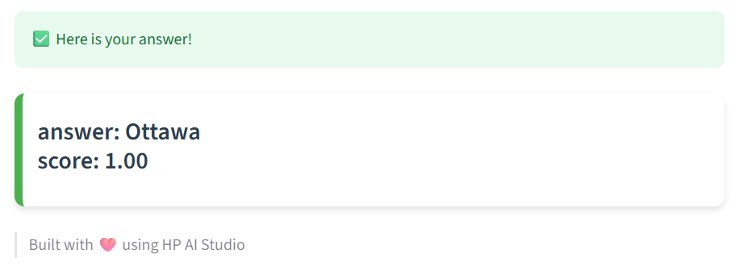

# ❓ Question and Answer with BERT

<div align="center">


</div>

### 📚 Content

* [🧠 Overview](#overview)
* [🗂 Project Structure](#project-structure)
* [⚙️ Setup](#setup)
* [🚀 Usage](#usage)
* [📞 Contact and Support](#contact-and-support)

## Overview

 The Bidirectional Encoder Representations from Transformers (BERT) is based on a deep learning model in which every output is connected to every input, and the weightings between them are dynamically calculated based upon their connection. BERT model can be fine-tuned with just one additional output layer to create state-of-the-art models for a wide range of tasks, such as question answering and language inference, without substantial task-specific architecture modifications.

 ---

## Project Structure
```
├── code/                                                             # Demo code
│
├── demo/                                                             # Compiled Interface Folder
│
├── docs/
│   └── html-ui-handwritten-digit-classification.pdf                  # UI screenshot
│   └── html-ui-handwritten-digit-classification.png                  # UI screenshot
│   └── streamlit-ui-handwritten-digit-classification.pdf             # Streamlit screenshot
│   └── streamlit-ui-handwritten-digit-classification.png             # Streamlit screenshot
│   └── swagger-ui-question-answering-with-bert.pdf                   # Swagger screenshot
│   └── swagger-ui-question-answering-with-bert.png                   # Swagger screenshot
│
├── notebooks
│   └── register-model.ipynb                                          # Notebook for registering trained models to MLflow
│   └── run-workflow.ipynb                                            # Notebook for executing the pipeline using custom inputs and configurations
│
├── README.md                                                         # Project documentation
│
├── requirements.txt                                                  # Dependency file for installing required packages

```

## Setup

### 0 ▪ Minimum Hardware Requirements

Ensure your environment meets the minimum compute requirements for smooth performance:

- **RAM**: 16 GB
- **VRAM**: 4 GB
- **GPU**: NVIDIA GPU

### 1 ▪ Create an AI Studio Project

- Create a new project in [Z by HP AI Studio](https://zdocs.datascience.hp.com/docs/aistudio/overview).

### 2 ▪ Set Up a Workspace

- Choose **Deep Learning** as the base image.

### 3 ▪ Clone the Repository

```bash
https://github.com/HPInc/AI-Blueprints.git
```

- Ensure all files are available after workspace creation.

---

## Usage

### 1 ▪ Run the Notebook
Run the following notebook `/run-workflow.ipynb`:
1. Download the dataset from the HuggingFace datasets repository.
2. Tokenize, preparing the inputs for the model.
3. Load metrics and transform the output model (Logits) to numbers.
4. Train, using the model:
```
model = AutoModelForQuestionAnswering.from_pretrained(model_checkpoint_bbc)

```
5. Complete the training evaluation of the model.
6. Create a question-answering pipeline from transformers and pass the model to it.

**Disclaimer**: The number of training steps has been intentionally reduced to optimize computational efficiency and minimize training time. However, this parameter can be adjusted if further model performance improvements are desired.

### 2 ▪ Run the Notebook
Only after running the `/run-workflow.ipynb` notebook, run the following notebook `/register-model.ipynb`:
1. Log Model to MLflow
2. Fetch the Latest Model Version from MLflow
3. Load the Model and Run Inference

### 3 ▪ Deploy
1. Navigate to **Deployments > New Service** in AI Studio.
3. Name the service and select the registered model.
4. Choose an available model version and configure it with **GPU acceleration**.
5. Start the deployment.
6. Once deployed, click on the **Service URL** to access the Swagger API page.
7. At the top of the Swagger API page, follow the provided link to open the demo UI for interacting with the locally deployed model.

### 3 ▪ Swagger / raw API

Once deployed, access the **Swagger UI** via the Service URL.


Paste a payload like:

```
{
  "inputs": {
    "context": [
      "Gabriela has a dog called Liz"
    ],
    "question": [
      "what is the name of Gabriela`s dog"
    ]
  },
  "params": {
    "show_score": true
  }
}

```

And as response:

```
{
  "predictions": {
    "score": 0.9800336360931396,
    "start": 26,
    "end": 29,
    "answer": "Liz"
  }
}
```

### Step 4: Launch the Streamlit Web App

1. After completing the local deployment, open the Streamlit web app using the deployment URL provided by AI Studio.
2. For additional details on how the Streamlit app works, refer to the `README.md` file in the `demo/streamlit` folder.

### Streamlit Preview




---

# Contact and Support

- Issues: Open a new issue in our [**AI-Blueprints GitHub repo**](https://github.com/HPInc/AI-Blueprints).

- Docs: Refer to the **[AI Studio Documentation](https://zdocs.datascience.hp.com/docs/aistudio/overview)** for detailed guidance and troubleshooting.

- Community: Join the [**HP AI Creator Community**](https://community.datascience.hp.com/) for questions and help.

---

> Built with ❤️ using [**HP AI Studio**](https://www.hp.com/us-en/workstations/ai-studio.html).
