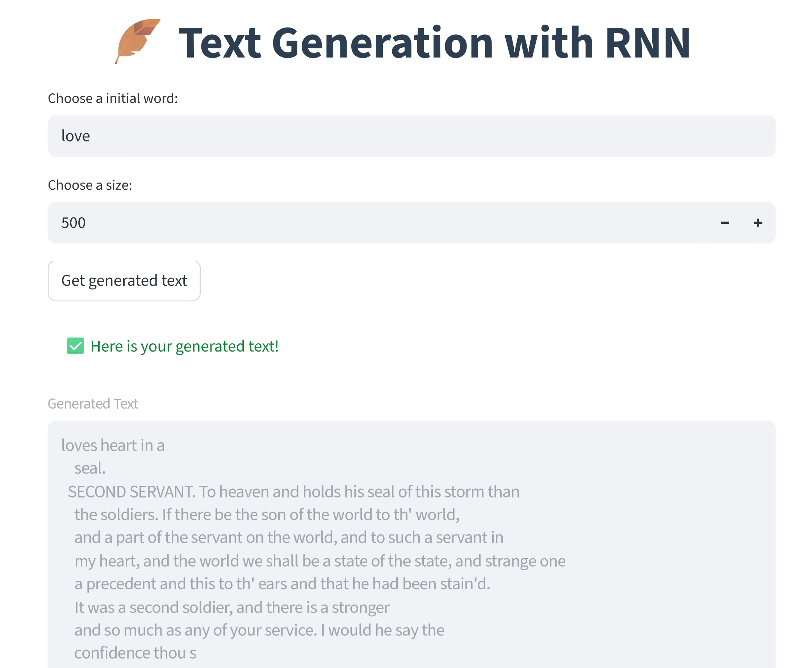

# 📜 Text Generation with RNN

<div align="center">


</div>

### 📚 Content

* [🧠 Overview](#overview)
* [🗂 Project Structure](#project-structure)
* [⚙️ Setup](#setup)
* [🚀 Usage](#usage)
* [📞 Contact and Support](#contact-and-support)

## Overview

The objective of this template is to show how to create a simple text generation with trained models from Hugging Face, one character at a time using a dataset of Shakespeare's texts.

 ---


## Project Structure

```
├── configs/
│   └── config.yaml                  # Deployment configuration
│
├── demo/                            # Compiled interface assets
│
├── docs/
│   └── streamlit-ss.png             # Streamlit web app screenshot
│
├── models/
│   ├── decoder.pt                   # Reconstructs compressed input back to its original form
│   └── encoder.pt                   # Compresses input into a compact, feature-rich representation
│
├── notebooks/
│   ├── other-notebooks/
│   │   └── run-workflow-with-tensorflow.ipynb   # Workflow using a TensorFlow-trained model
│   ├── run-workflow.ipynb            # Workflow using a Torch-trained model
│   └── register-model.ipynb          # Model registration and deployment
│
├── src/
│   └── utils/                        # Utility functions for notebooks
│
├── README.md                         # Project documentation
├── requirements.txt                         # Pip packages needed
```


## Setup

### 0 ▪ Minimum Hardware Requirements

Ensure your environment meets the minimum compute requirements for smooth performance:

- **RAM**: 16 GB
- **VRAM**: 4 GB
- **GPU**: NVIDIA GPU

### 1 ▪ Create an AI Studio Project

- Create a new project in [Z by HP AI Studio](https://zdocs.datascience.hp.com/docs/aistudio/overview).

### 2 ▪ Set Up a Workspace

- Choose **Deep Learning** as the base image.

### 3 ▪ Clone the Repository

```bash
https://github.com/HPInc/AI-Blueprints.git
```

- Ensure all files are available after workspace creation.

---

## Usage

### 1.1 ▪ Run the Notebook with PyTorch

Execute the notebook `notebooks/run-workflow.ipynb` to train and test the model. The workflow includes the following steps:

1. **Load the Dataset**
   Import the text data from `shakespeare.txt`.

2. **Prepare the Data**
   Encode the textual data into a numerical format suitable for training the model.

3. **Create Training Batches**
   Split the dataset into smaller, manageable batches to feed into the model during training.

4. **Build the GRU Model**
   Define and compile a GRU-based neural network for text generation.

5. **Train the Model**
   Train the model for the selected number of epochs.

6. **Generate Predictions**
   Produce predictions using the seed words *"Confidence"* and *"Love"*. (You can modify these seed words as desired.)

---

> **Disclaimer**
> The number of training steps and the size of the training/validation datasets have been intentionally reduced to optimize computational efficiency and minimize runtime. These parameters can be adjusted if additional performance improvements are required.

### 1.2 ▪ Run the Notebook with Tensorflow:
Run the following notebook `notebooks/other-notebooks/run-workflow-with-tensorflow.ipynb`:
1. Obtain text data from the shakespeare.txt.
2. Prepare the textual data. It's necessary to decode and encode the data to give the model a proper numerical representation of the text.
3. One Hot Encoding to convert categorical data into a fixed-size vector of numerical values.
4. Create Training Batches for dividing the dataset into smaller, manageable groups of data points that are fed into a machine learning model during the training process.
5. Create the LSTM Model with the decoder and encoder files
6. Train the Network to do the Predictions
7. Generate the Predictions with the words 'Confidence' and 'Love'. The words can be changed.

### Step 2: Deploy the Service
1. Execute `notebooks/register-model.ipynb ` to register the model in MLflow and create the API logic.
2. Navigate to **Deployments > New Service** in AI Studio.
3. Name the service and select the registered model.
4. Choose an available model version and configure it with **GPU acceleration**.
5. Start the deployment.
6. Once deployed, click on the **Service URL** to access the Swagger API page.
7. At the top of the Swagger API page, follow the provided link to open the demo UI for interacting with the locally deployed model.

### 3: Swagger / raw API

Once deployed, access the **Swagger UI** via the Service URL.

Paste a payload like:

```
{
  "inputs": {
    "initial_word": [
      "love"
    ],
    "size": [
      100
    ]
  },
  "params": {}
}

```

And as response:

```
{
  "predictions": "love is\n      an one that was a maider, which it is a more a town\n     on the state, that was the state o"
}

```

### Step 4: Launch the Streamlit Web App

1. After completing the local deployment, open the Streamlit web app using the deployment URL provided by AI Studio.
2. For additional details on how the Streamlit app works, refer to the `README.md` file in the `demo/streamlit` folder.

### Streamlit Preview




---

## Contact and Support

- Issues: Open a new issue in our [**AI-Blueprints GitHub repo**](https://github.com/HPInc/AI-Blueprints).

- Docs: Refer to the **[AI Studio Documentation](https://zdocs.datascience.hp.com/docs/aistudio/overview)** for detailed guidance and troubleshooting.

- Community: Join the [**HP AI Creator Community**](https://community.datascience.hp.com/) for questions and help.

---

> Built with ❤️ using [**HP AI Studio**](https://www.hp.com/us-en/workstations/ai-studio.html).
