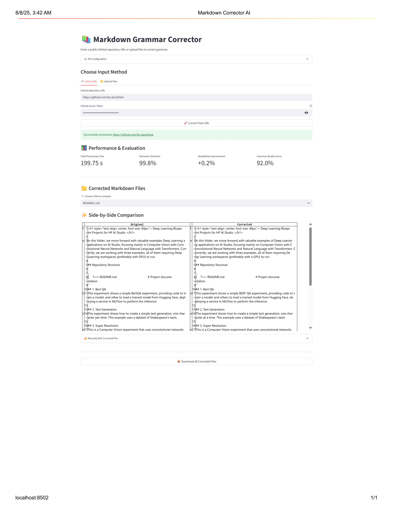

# Grammar Correction with LangChain

<div align="center">


</div>

## 📚 Contents

- [🧠 Overview](#overview)
- [🗂 Project Structure](#project-structure)
- [⚙️ Setup](#setup)
- [🚀 Usage](#usage)
- [📞 Contact and Support](#contact-and-support)

---

# Overview

This project demonstrates how to perform English grammar correction in GitHub Markdown files using a local LLaMA language model and LangChain. The system uses placeholder substitution and reconstruction techniques to ensure Markdown structure is preserved during correction, making it ideal for grammar refinement in documentation and technical repositories.

---

# Project Structure

```
├── configs
│   └── configs.yaml                                                  # General settings
├── demo
│   └── assets
│      └── background.png                                             # Background image for UI
│   └── streamlit-webapp
│      └── README.md                                                  # Streamlit Documentation
│      └── main.py                                                    # Streamlit UI
├── docs
│   └── eval_metrics.pdf                                              # Evaluation metrics explanations
├── notebooks
│   └── run-workflow.ipynb                                            # Main notebook for the project
│   └── register-model.ipynb                                          # MLflow registration and evaluation notebook
├── src
│   └── __init__.py                                                   # Marks directory as a package
│   └── chunker.py                                                    # Markdown chunker
│   └── github_extractor.py                                           # GitHub markdown file extractor
│   └── llm_metrics.py                                                # Custom MLflow evaluation metrics
│   └── markdown_correction_service.py                                # Custom MLflow model class
│   └── parser.py                                                     # Markdown parser to insert placeholders
│   └── prompt_templates.py                                           # Model prompts
│   └── utils.py                                                      # Reusable helper functions
├── README.md                                                         # Project documentation
├── requirements.txt                                                  # Required dependancies

```

# Setup

### Step 0 ▪ Minimum Hardware Requirements

Ensure your environment meets the minimum compute requirements for smooth image classification performance:

- **RAM**: 32 GB
- **VRAM**: 8 GB
- **GPU**: NVIDIA GPU

### Step 1 ▪ Create an AI Studio Project

1. Create a **New Project** in [Z by HP AI Studio](https://zdocs.datascience.hp.com/docs/aistudio/overview).
2. (Optional) Add a description and relevant tags.

### Step 2 ▪ Set Up a Workspace

1. Choose **Local Gen AI** as the base image.
2. Upload the requirements.txt file and install dependencies.

### Step 3: Verify Project Files

1. Clone the GitHub repository:
   ```
   git clone https://github.com/HPInc/AI-Blueprints.git
   ```
2. Make sure the folder `generative-ai/english-correction-with-langchain` is present inside your workspace.

### Step 4: Add the Model to the Workspace

1. Download the Meta Llama-3.1-8b-instruct
- Model Name: `llama3.1-8b-instruct`
- Model Source: `AWS S3`
- S3 URI: `s3://149536453923-hpaistudio-public-assets/Meta-Llama-3.1-8B-Instruct-Q8_0`
- Bucket Region: `us-west-2`
- Make sure the model is in the `datafabric` folder inside your workspace

### Step 5: Configure Configs and Secrets Manager

- Edit `config.yaml` with relevant configuration details.

- Secrets Configuration:
  - (Option 1) Go to **Project Setup > Setup > Secrets Manager** in AI Studio.
  - (Option 2) Create `secrets.yaml` file in the `configs` folder and add keys.
  - Add the following secrets:
     - GITHUB_ACCESS_TOKEN: Your GitHub Personal Access Token (PAT)
     - Settings > Developer settings > Personal access tokens > Tokens (classic) > Generate new token (classic) > Check the `repo` checkbox > Generate token

### Step 6: Use a Custom Kernel for Notebooks

1. In Jupyter notebooks, select the **aistudio kernel** to ensure compatibility.

---

# Usage

### Step 1 ▪ Run the Main Notebook

Execute the notebook inside the `notebooks` folder:

```bash
notebooks/run-workflow.ipynb
```

This will:

- Extract GitHub markdown files from the given repository.
- Parse the markdown files with placeholders.
- Chunk the placeholder markdown files.
- Initialize a LLaMa model and pass all markdown chunks through it.
- Output results into a directory.

### Step 2 ▪ Run the Registration and Evaluation Notebook

```bash
notebooks/register-model.ipynb
```

This will:

- Emulate processing workflow from run-workflow.ipynb
- Register the model with MLflow.
- Run custom evaluation metrics on the model.

### Step 3 ▪ Deploy the Model

1. Go to **Deployments > New Service** in AI Studio.
2. Name the service and select the registered model.
3. Choose a model version and select **With GPU** for **GPU Configuration**.
4. Choose the workspace.
5. Start the deployment.
6. Once deployed, open the Service URL to access the Swagger API page.

### Step 4: Launch the Streamlit Web App

1. After completing the local deployment, open the Streamlit web app using the deployment URL provided by AI Studio.
2. For additional details on how the Streamlit app works, refer to the `README.md` file in the `demo/streamlit` folder.

### Streamlit Preview




---

# Contact and Support

- Issues: Open a new issue in our [**AI-Blueprints GitHub repo**](https://github.com/HPInc/AI-Blueprints).

- Docs: Refer to the **[AI Studio Documentation](https://zdocs.datascience.hp.com/docs/aistudio/overview)** for detailed guidance and troubleshooting.

- Community: Join the [**HP AI Creator Community**](https://community.datascience.hp.com/) for questions and help.

---

> Built with ❤️ using [**HP AI Studio**](https://www.hp.com/us-en/workstations/ai-studio.html).
