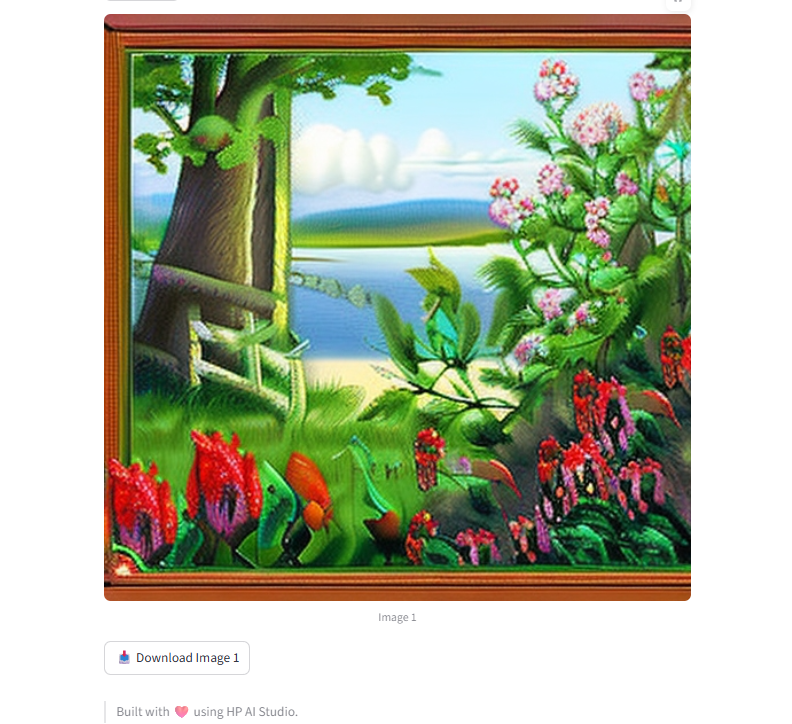

# DreamBooth Inference with Stable Diffusion XL

<div align="center">


</div>

### Content

- [🧠 Overview](#overview)
- [🗂 Project Structure](#project-structure)
- [⚙️ Setup](#setup)
- [🚀 Usage](#usage)
- [📞 Contact and Support](#contact-and-support)

## Overview

This notebook performs image generation inference using the **Stable Diffusion XL (SDXL)** architecture, with support for both standard and DreamBooth fine-tuned models.


## Project Structure

```text
├── configs
│   └── config.yaml                                                     # Blueprint configuration (UI mode, ports, service settings)
├── core
│   ├── common/                                                         # Common utilities
│   ├── custom_metrics/                                                 # Custom metrics implementations
│   ├── deploy/                                                         # Deployment utilities
│   ├── dreambooth_inference/                                           # DreamBooth inference modules
│   ├── local_inference/                                                # Local inference implementations
│   └── train/                                                          # Training modules
├── data
│   ├── inputs/                                                         # Input data directory
│   └── outputs/                                                        # Generated images directory
├── demo/
│   ├── streamlit/                                                    # Streamlit UI for deployment
│   │   ├── assets/                                                   # Logo assets
│   │   ├── main.py                                                   # Streamlit application
│   │   └── ...                                                       # Additional Streamlit files
├── docs
│   ├── Diagram dreambooth.png                                          # DreamBooth architecture diagram
│   └── successful-swagger-ui-image-generation-result.pdf               # Swagger UI documentation
│   └── streamlit-ui-image-generation.pdf                               # Streamlit UI documentation
├── notebooks
│   ├── register-model.ipynb                                            # Model registration notebook
│   └── run-workflow.ipynb                                              # Main image generation notebook
├── src
│   ├── __init__.py
│   └── utils.py                                                        # Utility functions for config loading
├── README.md
└── requirements.txt
```

---

## Configuration

The blueprint uses a centralized configuration system through `configs/config.yaml`:

```yaml
ui:
  mode: streamlit # UI mode: streamlit or static
  ports:
    external: 8501 # External port for UI access
    internal: 8501 # Internal container port
  service:
    timeout: 30 # Service timeout in seconds
    health_check_interval: 5 # Health check interval in seconds
    max_retries: 3 # Maximum retry attempts
```

---

## Setup

### Step 0: Minimum Hardware Requirements

Ensure your environment meets the minimum hardware requirements for smooth SDXL model inference:

- **RAM:** 16 GB (32 GB recommended for training)
- **VRAM:** 10 GB minimum, 12 GB+ recommended for SDXL
- **GPU:** NVIDIA GPU with Compute Capability 7.0+ (RTX 20 series or newer recommended)
- **Storage:** 20 GB for model weights and outputs

**Note:** SDXL requires more VRAM than SD 1.5/2.1 due to dual text encoders and higher resolution (1024x1024 native).

### Step 1: Create an AI Studio Project

1. Create a **New Project** in AI Studio.
2. (Optional) Add a description and relevant tags.

### Step 2: Create a Workspace

1. Select **Local GenAI** as the base image.
2. Upload the requirements.txt file and install dependencies.

### Step 3: Verify Project Files

1. Clone the GitHub repository:
   ```
   git clone https://github.com/HPInc/AI-Blueprints.git
   ```
2. Make sure the folder `generative-ai/image-generation-with-stablediffusion` is present inside your workspace.

### Step 4: Use a Custom Kernel for Notebooks

1. In Jupyter notebooks, select the **aistudio kernel** to ensure compatibility.

> ⚠️ **GPU Compatibility Notice**
> If you are using an older GPU architecture (e.g., **pre-Pascal**, such as **Maxwell or earlier**, like the GTX TITAN X), you may experience CUDA timeout errors during inference or training due to hardware limitations.
> To ensure stable execution, uncomment the line below at the beginning of your script or notebook to force synchronous CUDA execution:

```python
os.environ["CUDA_LAUNCH_BLOCKING"] = "1"
```

### Step 5: Configure Secrets

- **Configure Secrets in YAML file (Freemium users):**
  - Create a `secrets.yaml` file in the `configs` folder and list your API keys there:
    - `HUGGINGFACE_API_KEY`: Required to use Hugging Face-hosted models instead of a local LLaMA model.

- **Configure Secrets in Secrets Manager (Premium users):**
  - Add your API keys to the project's Secrets Manager vault, located in the `Project Setup` tab -> `Setup` -> `Project Secrets`:
    - `HUGGINGFACE_API_KEY`: Required to use Hugging Face-hosted models instead of a local LLaMA model.
  - In `Secrets Name` field add: `HUGGINGFACE_API_KEY`
  - In the `Secret Value` field, paste your corresponding key generated by Hugging Face.

  <br>

  **Note: If both options (YAML option and Secrets Manager) are used, the Secrets Manager option will override the YAML option.**

### Step 6: Setup Configuration

- Edit `config.yaml` with relevant configuration details:
  - `model_source`: Choose between `local`, `hugging-face-cloud`, or `hugging-face-local`
  - `ui.mode`: Set UI mode to `streamlit` or `static`
  - `ports`: Configure external and internal port mappings
  - `service`: Adjust MLflow timeout and health check settings
  - `proxy`: Set proxy settings if needed for restricted networks

**SDXL-Specific Configuration:**
- Default model: `stabilityai/stable-diffusion-xl-base-1.0`
- Recommended resolution: 1024x1024 (native SDXL resolution)
- Minimum resolution: 768x768
- Maximum resolution: 2048x2048
- The system automatically detects SDXL vs SD 1.5/2.1 models and loads the appropriate pipeline


## Usage

### Step 1: Run the Workflow Notebook

Execute the notebook inside the `notebooks` folder:

```bash
notebooks/run-workflow.ipynb
```

1. The `stable-diffusion-2-1` model is downloaded automatically from Hugging Face.
2. In the Training DreamBooth section of the notebook:
  - Train your DreamBooth model.

**Disclaimer**: The number of training steps has been intentionally reduced to optimize computational efficiency and minimize training time. However, this parameter can be adjusted if further model performance improvements are desired.

### Step 2: Run the Register Notebook

Execute the notebook inside the `notebooks` folder:

```bash
notebooks/register-model.ipynb
```

This will:

- Monitor metrics using the **Monitor tab**, MLflow, and TensorBoard.
- Register the model in MLflow


### Step 2: Deploy the Image Generation Service:

1. After running the entire notebook, go to **Deployments > New Service** in AI Studio.
2. Create a service named as desired and select the **ImageGenerationLogger** model.
3. Choose a model version and enable **GPU acceleration**.
4. Deploy the service.
5. Once deployed, open the Service URL to access the Swagger API page.
6. How to use the API.

| Field                 | Description                                                                |
| --------------------- | -------------------------------------------------------------------------- |
| `prompt`              | Your input prompt  |
| `use_finetuning`      | `True` to use your fine-tuned DreamBooth model, `False` for the base model |
| `height`, `width`     | Image dimensions (SDXL: 768-2048px, optimal: 1024x1024)                    |
| `num_images`          | Number of images to generate                                               |
| `num_inference_steps` | Number of denoising steps (SDXL: 30-50 recommended)                        |

8. The API will return a base64-encoded image. You can convert it to a visual image using: https://base64.guru/converter/decode/image

### Step 3: Launch the Streamlit Web App

1. After completing the local deployment, open the Streamlit web app using the deployment URL provided by AI Studio.
2. For additional details on how the Streamlit app works, refer to the `README.md` file in the `demo/streamlit` folder.

### Streamlit Preview




---

## Contact and Support

- Issues & Bugs: Open a new issue in our [**AI-Blueprints GitHub repo**](https://github.com/HPInc/AI-Blueprints).

- Docs: [**AI Studio Documentation**](https://zdocs.datascience.hp.com/docs/aistudio/overview).

- Community: Join the [**HP AI Creator Community**](https://community.datascience.hp.com/) for questions and help.

---

> Built with ❤️ using [**Z by HP AI Studio**](https://www.hp.com/us-en/workstations/ai-studio.html)
