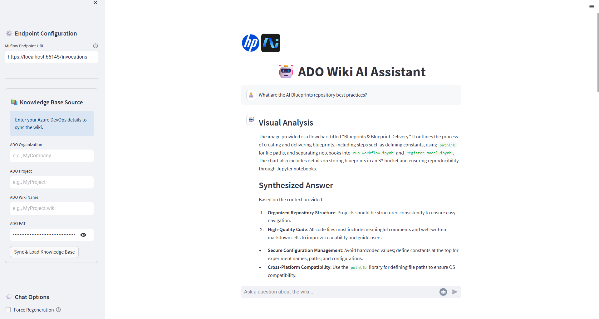

# 🤖 MultiModal RAG with LangChain and vLLM

<div align="center">


</div>

# 📚 Contents

- [🧠 Overview](#overview)
- [🗂 Project Structure](#project-structure)
- [⚙️ Setup](#setup)
- [🚀 Usage](#usage)
- [📞 Contact and Support](#contact-and-support)

---

## Overview

🤖 MultiModal RAG with LangChain, Transformers, and Torch

Overview
This project implements an AI-powered Multimodal **RAG (Retrieval-Augmented Generation)** chatbot. It is orchestrated using **LangChain**, with **vLLM** serving the underlying `Qwen2.5-VL-7B-Instruct-GPTQ-Int4` model (built on **Hugging Face Transformers** and **PyTorch**) for fast, efficient inference, and **MLflow** for model evaluation and observability. The chatbot leverages the **Z by HP AI Studio Local GenAI image** to quickly get started to generate contextual answers, grounded in both documents and images, to user queries about internal documentation. In this example, the primary data source is an Azure DevOps Wiki.

---

## Project Structure

```
multi-modal-rag-with-langchain-vllm/
├── .gitignore
├── README.md
├── requirements.txt
├── configs/
│   └── ...
├── data/
│   ├── chroma_store/
├── context/
│   ├── images/
│   ├── AIStudioDoc.pdf
│   ├── wiki_flat_structure.json
├── demo/
│   └── streamlit-webapp/
│       ├── assets/
│       ├── main-for-cloud.py
│       ├── main.py
│       └── README.md
├── notebooks/
│   ├── register-model.ipynb
│   └── run-workflow.ipynb
├── src/
│   ├── components.py
│   ├── local_genai_judge.py
│   ├── utils.py
│   └── wiki_pages_clone.py
├── .gitignore
├── README.md
└── requirements.txt
```

---

## Setup

### Hardware Requirements

#### Minimum Hardware Requirements

To ensure smooth execution and reliable model deployment, make sure your system meets the following minimum hardware specifications:

- RAM: 32 GB
- VRAM: 24 GB
- GPU: NVIDIA GPU with CUDA 12.1+

#### Recommended Hardware Requirements

For optimal performance, especially when working with larger models or datasets, consider the following recommended hardware specifications:

- RAM: 64 GB
- VRAM: 48 GB
- GPU: NVIDIA RTX A6000 or equivalent with CUDA 12.1+

### Step 1: Create a new AI Studio Project

- Create a new project in [Z by HP AI Studio](https://zdocs.datascience.hp.com/docs/aistudio/overview).

### Step 2: Set Up a Workspace

- Choose **Local GenAI** as the base image.
- Upload `requirements.txt` file from the project directory to the pip packages section of your AI Studio workspace.
- Press **save**

### Step 3: Add the Model to the Workspace

- If the model is not added to the workspace it will be downloaded automatically to the `datafabric` folder when you run the notebook. No manual steps are required, but provided for your convenience.

- Download the **Qwen2.5-VL-7B-Instruct-GPTQ-Int4** model from AWS S3 using the Models tab in your AI Studio project:
  - **Model Name**: `Qwen2.5-VL-7B-Instruct-GPTQ-Int4`
  - **Model Source**: `AWS S3`
  - **S3 URI**: `tbd`
  - **Bucket Region**: `us-west-2`
- Make sure that the model is in the `datafabric` folder inside your jupyter notebook workspace. If the model does not appear after downloading, please restart your workspace.

The notebook checks for the model at:

### Step 4: Manual Model Download to the Workspace

- If you prefer to download the model manually, you can do so from the Hugging Face Model Hub:

- Go to the [hfl/Qwen2.5-VL-7B-Instruct-GPTQ-Int4](https://huggingface.co/hfl/Qwen2.5-VL-7B-Instruct-GPTQ-Int4/tree/main).
- Download the model files manually and place them in a folder named `Qwen2.5-VL-7B-Instruct-GPTQ-Int4`.
- Upload the `Qwen2.5-VL-7B-Instruct-GPTQ-Int4` folder with the model using the Models tab in your AI Studio project:
  - **Model Name**: `Qwen2.5-VL-7B-Instruct-GPTQ-Int4`
  - **Model Source**: `Local`
  - **Model Path**: `C:\path_to_your_model\Qwen2.5-VL-7B-Instruct-GPTQ-Int4`
- Make sure that the model is in the `datafabric` folder inside your jupyter notebook workspace. If the model does not appear after downloading, please restart your workspace.

### Step 5: Clone the Repository

1. Press `advantced options` in the project creation slide

2. Use the link to clone the GitHub repository:

   ```
    https://github.com/HPInc/AI-Blueprints.git
   ```

2. Navigate to `AI-Blueprints/generative-ai/multimodal-rag-with-langchain-vllm` to ensure all files are cloned correctly after workspace creation.

3. Configure the `requirements.txt` torch packages to your corresponding cuda version
    - Verify cuda version by pasting `nvidia-smi` in your terminal
    - Replace torch wheel with your corresponding cuda version `cu128` if using Cuda 1.28, i.e. `https://download.pytorch.org/whl/cu128`

4. Select **Create Project**


### Step 6: Configure Configs and Secrets Manager

#### Config File Configuration
- Edit `config.yaml` with the relevant configurations below:
```
AZURE_DEVOPS_ORG: "your-organization-name"
AZURE_DEVOPS_PROJECT: "your-project-name"
AZURE_DEVOPS_WIKI_IDENTIFIER: "your-wiki-name.wiki"
```

#### Secrets Configuration:

Using Secrets Manager (Premium User)
  - Go to **Project Setup > Setup > Secrets Manager** in AI Studio.
  - Add the following secrets:
    - `ADO_TOKEN`: Your Azure DevOps Personal Access Token (PAT) with the following access rights:
      - **Wiki (Read)**: To read wiki content.
      - **Code (Read)**: To read code content.
      - Guide on How to get your ADO PAT Token here: [Microsoft ADO PAT Guide](https://learn.microsoft.com/en-us/azure/devops/organizations/accounts/use-personal-access-tokens-to-authenticate?view=azure-devops&tabs=Windows)

Using `secrets.yaml` (Freemium User)
  - Navigate to `AI-Blueprints/generative-ai/multimodal-rag-with-langchain-vllm/configs`
  - Create a `secrets.yaml` file with the following credentials below:
  ```
  AIS_ADO_TOKEN: "YOUR_PAT_TOKEN"
  ```

---

## Usage

### Step 1: First Run the Multimodal RAG Workflow

Execute the following notebook inside the `notebooks/` folder to see the Multimodal RAG workflow in action:

- **`run-workflow.ipynb`**


### Step 2: Second Register the Multimodal RAG Model in MLflow

Run the following notebook in the `notebooks/` folder to register the Multimodal RAG model in MLflow:

- **`register-model.ipynb`**

Note: For this notebook, we recreate the database every query to ensure that the model is always up-to-date with the latest data. This is particularly useful for scenarios where the underlying data changes frequently, such as in a dynamic wiki environment. Note that this approach may not be suitable for all use cases, especially if the database is large or if performance is a concern.

In such cases, you may want to explore:
- **`other-notebooks/register-model.ipynb`**

This notebook demonstrates how to register the model without recreating the database every time by caching the Chroma databases and query results. This approach is more efficient for larger datasets or when the data does not change frequently.

### Step 3: Third Deploy the Multimodal RAG Service Locally

- Go to **Deployments > New Service** in AI Studio.
- Name the service and select the registered model.
- Choose a model version and enable **GPU acceleration**.
- Start the deployment.
- Once deployed, access the **Swagger UI** via the Service URL.

#### Swagger API Request Input Body Schema

```
{
  "inputs": {
    "query": [
      "string"
    ],
    "payload": [
      "string"
    ],
    "force_regenerate": [
      true
    ]
  },
  "params": {}
}
```
You can make a inference query in the Swagger UI by altering the string field to your question.


### Step 4: Visualize the Multimodal RAG Service with Streamlit
- Navigate to the `demo/streamlit/` folder.

We have provided two options for visualizing the Multimodal RAG service:
- **`main-for-cloud.py`**: This file is designed to run in the cloud and connects to the deployed service using ngrok. We recommend using this file for public cloud deployments as it does not require you to store any local private data.

- **`main.py`**: This file is designed to run locally and connects to the deployed service using the local service URL. We store the private data within the deployed service, which speeds up the inference process.

More information on how to run these files can be found in the `demo/streamlit-webapp/README.md` file.

### Successful Demonstration of the User Interface



---

## Contact and Support

- Issues & Bugs: Open a new issue in our [**AI-Blueprints GitHub repo**](https://github.com/HPInc/AI-Blueprints).

- Docs: [**AI Studio Documentation**](https://zdocs.datascience.hp.com/docs/aistudio/overview).

- Community: Join the [**HP AI Creator Community**](https://community.datascience.hp.com/) for questions and help.

---

> Built with ❤️ using [**Z by HP AI Studio**](https://www.hp.com/us-en/workstations/ai-studio.html).
