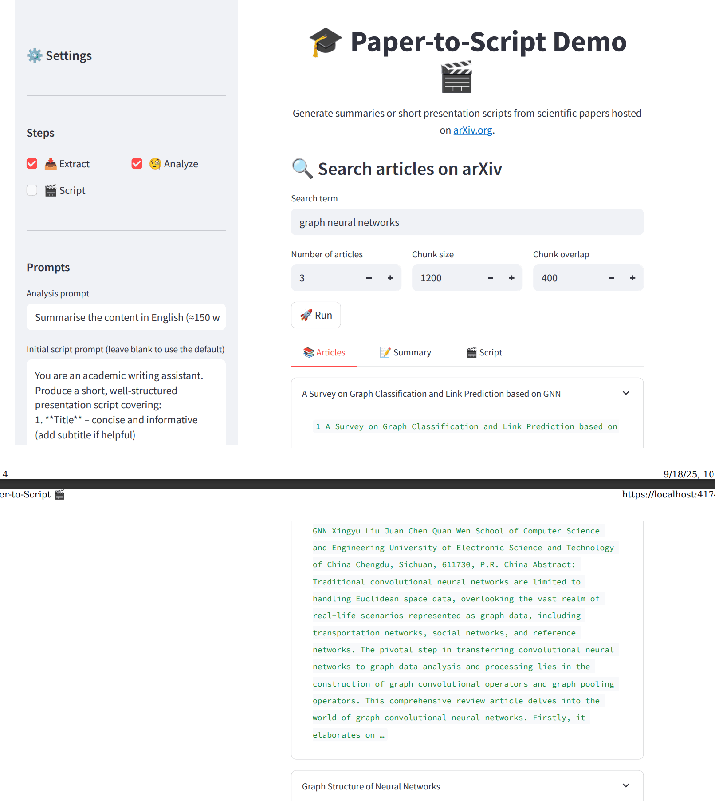

# Text Generation with LangChain

<div align="center">


</div>

## Content

- [🧠 Overview](#overview)
- [🗂 Project Structure](#project-structure)
- [⚙️ Configuration](#configuration)
- [🔧 Setup](#setup)
- [🚀 Usage](#usage)
- [📞 Contact and Support](#contact-and-support)

## Overview

This notebook implements a full Retrieval-Augmented Generation (RAG) pipeline for automatically generating a scientific presentation script. It integrates paper retrieval from arXiv, text extraction and chunking, embedding generation with HuggingFace, vector storage with ChromaDB, and context-aware generation using LLMs. It supports multi-source model loading including local Llama.cpp, HuggingFace-hosted, and HuggingFace-cloud models like Mistral or DeepSeek.

## Project Structure

```text
├── configs
│   └── config.yaml                                                     # Blueprint configuration (UI mode, ports, service settings)
├── core                                                                # Core Python modules
│   ├── analyzer/
│   │   └── scientific_paper_analyzer.py
│   ├── deploy/
│   │   └── text_generation_service.py
│   ├── extract_text/
│   │   └── arxiv_search.py
│   └── generator/
│       └── script_generator.py
├── demo                                                                # UI-related files
│   ├── static/                                                         # Static HTML UI files
│   ├── streamlit/                                                      # Streamlit webapp files
│   ├── main.py
│   ├── poetry.lock
│   ├── pyproject.toml
│   └── README.md
├── docs
│   ├── successful_streamlit_ui_text_generation_result.pdf             # Streamlit UI result pdf
│   ├── successful_swagger_ui_text_generation_result.pdf               # Swagger UI result pdf
│   └── streamlit_sucess.png                                           # Streamlit Success UI Screenshot
├── notebooks
│   ├── register-model.ipynb                                           # Model registration notebook
│   └── run-workflow.ipynb                                             # Main notebook for the project
├── src
│   ├── __init__.py
│   └── utils.py                                                        # Utility functions for config loading
├── README.md
└── requirements.txt
```

---

## Configuration

The blueprint uses a centralized configuration system through `configs/config.yaml`:

```yaml
ui:
  mode: streamlit # UI mode: streamlit or static
  ports:
    external: 8501 # External port for UI access
    internal: 8501 # Internal container port
  service:
    timeout: 30 # Service timeout in seconds
    health_check_interval: 5 # Health check interval in seconds
    max_retries: 3 # Maximum retry attempts
```

### 0 ▪ Minimum Hardware Requirements

Ensure your environment meets the minimum hardware requirements for smooth model inference:

- RAM: 16 GB
- VRAM: 8 GB
- GPU: NVIDIA GPU

### Quickstart

---

## Setup

### Step 1: Create an AIstudio Project

1. Create a **New Project** in AI Studio
2. Select the template **Text Generation with Langchain**
3. Add a title description and relevant tags.

### Step 2: Verify Project Files

1. Launch a workspace.
2. Navigate to `text-generation-with-langchain/` to ensure all files were cloned correctly.

## Alternative Manual Setup

### Step 1: Create an AIStudio Project

1. Create a **New Project** in AI Studio.

- (Optional) Add a description and relevant tags.

### Step 2: Create a Workspace

1. Choose **Local GenAI** as the base image when creating the workspace.

### Step 3: Clone the Repository and Verify Project Files

1. In the Project Setup tab, under Setup, clone the project repository:
   ```
   git clone https://github.com/HPInc/AI-Blueprints.git
   ```
2. Navigate to `text-generation-with-langchain/` to ensure all files are cloned correctly after workspace creation.

### Step 4: Download the Model

1. In the Models tab, click Add Model.
2. Download the model file: `Meta-Llama-3.1-8B-Instruct-Q8_0.gguf`
3. The model will be available under the /datafabric directory in your workspace.

### Step 5: Configure Secrets

- **Configure Secrets in YAML file (Freemium users):**

  - Create a `secrets.yaml` file in the `configs` folder and list your API keys there:
    - `HUGGINGFACE_API_KEY`: Required to use Hugging Face-hosted models instead of a local LLaMA model.

- **Configure Secrets in Secrets Manager (Premium users):**

  - Add your API keys to the project's Secrets Manager vault, located in the `Project Setup` tab -> `Setup` -> `Project Secrets`:
    - `HUGGINGFACE_API_KEY`: Required to use Hugging Face-hosted models instead of a local LLaMA model.
  - In `Secrets Name` field add: `HUGGINGFACE_API_KEY`
  - In the `Secret Value` field, paste your corresponding key generated by HuggingFace.

  <br>

  **Note: If both options (YAML option and Secrets Manager) are used, the Secrets Manager option will override the YAML option.**

### Step 6: Setup Configuration

1. Edit `config.yaml` with relevant configuration details:

- `model_source`: Choose between `local`, `hugging-face-cloud`, or `hugging-face-local`
- `ui.mode`: Set UI mode to `streamlit` or `static`
- `ports`: Configure external and internal port mappings
- `service`: Adjust MLflow timeout and health check settings
- `proxy`: Set proxy settings if needed for restricted networks

---

### Step 7: Use a Custom Kernel for Notebooks

1. In Jupyter notebooks, select the **aistudio kernel** to ensure compatibility.

## Usage

### Step 1: Run the Workflow Notebook

Execute the notebook inside the `notebooks` folder:

```bash
notebooks/run-workflow.ipynb
```

- In the **Run and Approve section**, you can customize prompts, add presentation sections, and view results directly in the notebook interface.

```python
generator.add_section(
    name="title",
    prompt="Generate a clear and concise title for the presentation that reflects the content. Add a subtitle if needed. Respond using natural language only."
)
```

### Step 2: Run the Register Notebook

Execute the notebook inside the `notebooks` folder:

```bash
notebooks/register-model.ipynb
```

This will:

- Register the model in MLflow

### Step 3: Deploy the Text Generation Service

1. In AI Studio, navigate to **Deployments > New Service**.
2. Give your service a name (e.g.“Text Generation Service”), then select the registered Script Generation Service.
3. Pick the desired model version and enable **GPU acceleration** for best performance.
4. Click **Deploy** to launch the service.

### Step 4: Swagger / Raw API

#### Example payload for text generation:

```json
{
  "inputs": {
    "query": "graph neural networks",
    "max_results": 1,
    "chunk_size": 1200,
    "chunk_overlap": 400,
    "do_extract": true,
    "do_analyze": true,
    "do_generate": true,
    "analysis_prompt": "Summarize the content in English (≈150 words).",
    "generation_prompt": "Create a concise 5-point presentation script based on the summary."
  }
}
```

#### Example curl command:

```bash
curl -X 'POST' \
  'http://localhost:5002/invocations' \
  -H 'accept: application/json' \
  -H 'Content-Type: application/json' \
  -d '{
  "inputs": {
    "query": "graph neural networks",
    "max_results": 1,
    "chunk_size": 1200,
    "chunk_overlap": 400,
    "do_extract": true,
    "do_analyze": true,
    "do_generate": true,
    "analysis_prompt": "Summarize the content in English (≈150 words).",
    "generation_prompt": "Create a concise 5-point presentation script based on the summary."
  }
}'
```

Paste the JSON payload into the Swagger "/invocations" endpoint and click **Try it out** to see the raw JSON response.

### Step 5: Launch the Streamlit Web App

1. After completing the local deployment, open the Streamlit web app using the deployment URL provided by AI Studio.
2. For additional details on how the Streamlit app works, refer to the `README.md` file in the `demo/streamlit` folder.

### Streamlit Preview



## Contact and Support

- Issues & Bugs: Open a new issue in our [**AI-Blueprints GitHub repo**](https://github.com/HPInc/AI-Blueprints).

- Docs: [**AI Studio Documentation**](https://zdocs.datascience.hp.com/docs/aistudio/overview).

- Community: Join the [**HP AI Creator Community**](https://community.datascience.hp.com/) for questions and help.

---

> Built with ❤️ using [**Z by HP AI Studio**](https://www.hp.com/us-en/workstations/ai-studio.html)
