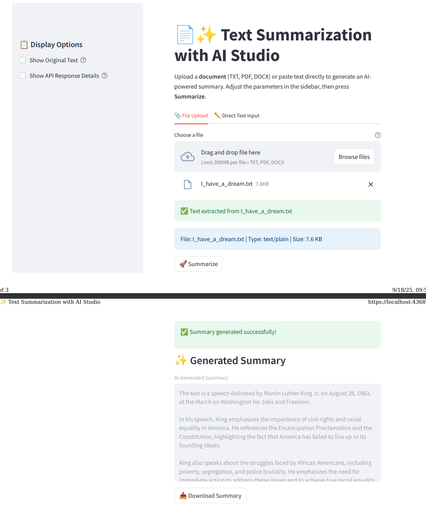

# Text Summarization with LangChain

<div align="center">


</div>

## 📚 Contents

- [🧠 Overview](#overview)
- [🗂 Project Structure](#project-structure)
- [⚙️ Configuration](#configuration)
- [🔧 Setup](#setup)
- [🚀 Usage](#usage)
- [📞 Contact and Support](#contact-and-support)

---

## Overview

This project demonstrates how to build a semantic chunking and summarization pipeline for texts using **LangChain** and **Sentence Transformers**. It leverages the **Z by HP AI Studio Local GenAI image** and the Meta Llama 3.1 model with 8B parameters to generate concise and contextually accurate summaries from text data.

The blueprint follows the universal MLflow structure with modular components in `src/mlflow/` for consistent model registration and deployment across AI Studio blueprints.

---

## Project Structure

```text
├── configs
│   └── config.yaml                                                     # Blueprint configuration (UI mode, ports, service settings)
├── data
│   ├── inputs/                                                         # Input data directory
│   └── outputs/                                                        # Generated summaries directory
├── demo
│   ├── static/                                                         # Static HTML UI files
│   └── streamlit/                                                      # Streamlit webapp files
├── docs
│   ├── sample-html-ss.png                                             # HTML UI screenshot
│   ├── sample-html-ui.pdf                                             # HTML UI page
│   ├── sample-streamlit-ss.png                                        # Streamlit UI screenshot
│   └── sample-streamlit-ui.pdf                                        # Streamlit UI page
├── notebooks
│   ├── register-model.ipynb                                           # Model registration notebook
│   └── run-workflow.ipynb                                             # Main text summarization notebook
├── src
│   ├── __init__.py
│   ├── mlflow/                                                         # Universal MLflow integration
│   │   ├── __init__.py                                                 # Exports Model and Logger classes
│   │   ├── model.py                                                    # Business logic layer - core functionality
│   │   ├── loader.py                                                   # MLflow integration layer - model loading
│   │   └── logger.py                                                   # Registration layer - model packaging
│   ├── prompt_templates.py                                            # LangChain prompt templates
│   ├── trt_llm_langchain.py                                           # TensorRT LLM integration
│   └── utils.py                                                        # Utility functions for config loading
├── README.md
└── requirements.txt
```

---

## Configuration

The blueprint uses a centralized configuration system through `configs/config.yaml`:

```yaml
ui:
  mode: streamlit # UI mode: streamlit or static
  ports:
    external: 8501 # External port for UI access
    internal: 8501 # Internal container port
  service:
    timeout: 30 # Service timeout in seconds
    health_check_interval: 5 # Health check interval in seconds
    max_retries: 3 # Maximum retry attempts
```

---

## Setup

### Step 0: Minimum Hardware Requirements

To ensure smooth execution and reliable model deployment, make sure your system meets the following minimum hardware specifications:

- RAM: 32 GB
- VRAM: 8 GB
- GPU: NVIDIA GPU

### Step 1: Create an AI Studio Project

- Create a new project in [Z by HP AI Studio](https://zdocs.datascience.hp.com/docs/aistudio/overview).
- (Optional) Add a description and relevant tags.

### Step 2: Set Up a Workspace

- Choose **Local GenAI** as the base image.

### Step 3: Clone the Repository

1. Clone the GitHub repository:

   ```
   git clone https://github.com/HPInc/AI-Blueprints.git
   ```

2. Ensure all files are available after workspace creation..

### Step 4: Add the Model to Workspace

1. Download the Meta Llama 3.1 model with 8B parameters via Models tab:

- **Model Name**: `meta-llama3.1-8b-Q8`
- **Model Source**: `AWS S3`
- **S3 URI**: `s3://149536453923-hpaistudio-public-assets/Meta-Llama-3.1-8B-Instruct-Q8_0`
- **Bucket Region**: `us-west-2`
- Make sure that the model is in the `datafabric` folder inside your workspace.

### Step 5: Configure Secrets

- **Configure Secrets in YAML file (Freemium users):**

  - Create a `secrets.yaml` file in the `configs` folder and list your API keys there:
    - `HUGGINGFACE_API_KEY`: Required to use Hugging Face-hosted models instead of a local LLaMA model.

- **Configure Secrets in Secrets Manager (Premium users):**

  - Add your API keys to the project's Secrets Manager vault, located in the `Project Setup` tab -> `Setup` -> `Project Secrets`:
    - `HUGGINGFACE_API_KEY`: Required to use Hugging Face-hosted models instead of a local LLaMA model.
  - In `Secrets Name` field add: `HUGGINGFACE_API_KEY`
  - In the `Secret Value` field, paste your corresponding key generated by HuggingFace.

  <br>

  **Note: If both options (YAML option and Secrets Manager) are used, the Secrets Manager option will override the YAML option.**

### Step 6: Setup Configuration

- Edit `config.yaml` with relevant configuration details:
  - `model_source`: Choose between `local`, `hugging-face-cloud`, or `hugging-face-local`
  - `ui.mode`: Set UI mode to `streamlit` or `static`
  - `ports`: Configure external and internal port mappings
  - `service`: Adjust MLflow timeout and health check settings
  - `proxy`: Set proxy settings if needed for restricted networks

---

## Usage

### Step 1: Run the Workflow Notebook

Execute the notebook inside the `notebooks` folder:

```bash
notebooks/run-workflow.ipynb
```

This will:

- Set up the semantic chunking pipeline
- Create the summarization chain with LangChain

### Step 2: Run the Register Notebook

Execute the notebook inside the `notebooks` folder:

```bash
notebooks/register-model.ipynb
```

This will:

- Register the model in MLflow

### Step 3: Deploy the Summarization Service

- Go to **Deployments > New Service** in AI Studio.
- Name the service and select the registered model.
- Choose a model version and enable **GPU acceleration**.
- Start the deployment.
- Once deployed, access the **Swagger UI** via the Service URL.
- Use the API endpoints to generate summaries from your text data.

### Step 4: Launch the Streamlit Web App

1. After completing the local deployment, open the Streamlit web app using the deployment URL provided by AI Studio.
2. For additional details on how the Streamlit app works, refer to the `README.md` file in the `demo/streamlit` folder.

### Streamlit Preview



**Note:** Current implementation of deployed model **do not** perform the chunking steps: summarization is run directly by the LLM model. In the case of the suggested local model (i.e., Llama 3.1-8b), texts with more than 1000 words may cause instabilities when summarization is triggered on the UI. We recommend using different models or smaller texts to avoid these problems.

---

## Contact and Support

- Issues & Bugs: Open a new issue in our [**AI-Blueprints GitHub repo**](https://github.com/HPInc/AI-Blueprints).

- Docs: [**AI Studio Documentation**](https://zdocs.datascience.hp.com/docs/aistudio/overview).

- Community: Join the [**HP AI Creator Community**](https://community.datascience.hp.com/) for questions and help.

---

> Built with ❤️ using [**Z by HP AI Studio**](https://www.hp.com/us-en/workstations/ai-studio.html).
