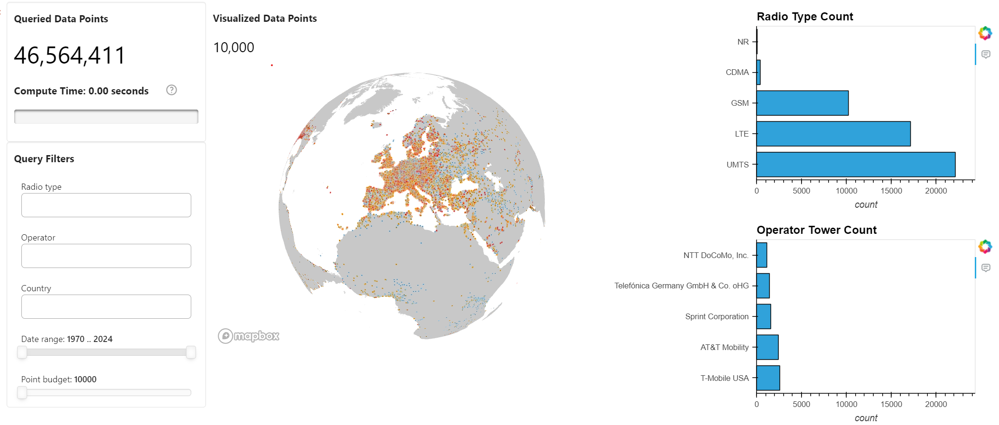

# 📡 Data Visualization with cuDF

<div align="center">


</div>

## 📚 Contents

- [🧠 Overview](#overview)
- [🗂 Project Structure](#project-structure)
- [⚙️ Setup](#setup)
- [🚀 Usage](#usage)
- [📞 Contact and Support](#contact-and-support)

---

## Overview

This project is a GPU-accelerated, interactive **exploratory data analysis (EDA)** dashboard for the [OpenCellID](https://www.opencellid.org/) dataset. It uses **Panel** and **cuDF** to deliver lightning-fast geospatial analysis and visualization.

You can explore cell tower distributions by radio type, operator, country, and time window — rendered live on an interactive map with full GPU acceleration.

---

## Project Structure

````
├── docs
|   ├── ui-opencellid-EU.png                                   # opencellid UI screenshot (European Union map)
│   └── ui-opencellid-US.png                                   # opencellid UI screenshot (United States map)
├── notebooks
│   └── run-workflow.ipynb                                     # Main notebook for the project
├── src                                                        # Core Python modules
│   └── opencellid_downloader.py
├── README.md                                                  # Project documentation
└── requirements.txt                                           # Python dependencies (used with pip install)
````

---

## Setup

### Step 0: Minimum Hardware Requirements

Ensure your environment meets the minimum compute requirements for smooth dashboard rendering and cuDF performance:

- **RAM**: 16 GB
- **VRAM**: 2 GB
- **GPU**: NVIDIA GPU

### Step 1: Create an AI Studio Project

- Create a new project in [Z by HP AI Studio](https://zdocs.datascience.hp.com/docs/aistudio/overview).

### Step 2: Set Up a Workspace

- Choose **RAPIDS Base** or **RAPIDS Notebooks** as the base image.

### Step 3: Clone the Repository

```bash
https://github.com/HPInc/AI-Blueprints.git
````

- Ensure all files are available after workspace creation.

---

## Usage

### Step 1: Run the Notebook

Execute the notebook inside the `notebooks` folder:

```bash
notebooks/run-workflow.ipynb
```

This will:

- Load the OpenCellID tower data and enrich it with operator metadata
- Apply GPU-accelerated filters with `cudf.pandas`
- Launch an interactive dashboard using `panel` and `pydeck` for geospatial rendering

### Step 2: Use the Dashboard

The notebook launches an embedded interactive dashboard featuring:

- **Filters**: Radio Type, Operator, Country, First Seen (Year), Point Budget
- **Charts**: Bar plots for radio and operator distributions
- **Map**: 3D scatterplot of cell tower locations with hover interactivity
- **Performance Metrics**: Visual indicators for data size and compute time

### Example Dashboard Snapshot



---

# Contact and Support

- **Troubleshooting:** Refer to the [**Troubleshooting**](https://github.com/HPInc/AI-Blueprints/tree/main?tab=readme-ov-file#troubleshooting) section of the main README in our public AI-Blueprints GitHub repo for solutions to common issues.

- **Issues & Bugs:** Open a new issue in our [**AI-Blueprints GitHub repo**](https://github.com/HPInc/AI-Blueprints).

- **Docs:** [**AI Studio Documentation**](https://zdocs.datascience.hp.com/docs/aistudio/overview).

- **Community:** Join the [**HP AI Creator Community**](https://community.datascience.hp.com/) for questions and help.

---

> Built with ❤️ using [**HP AI Studio**](https://hp.com/ai-studio).
