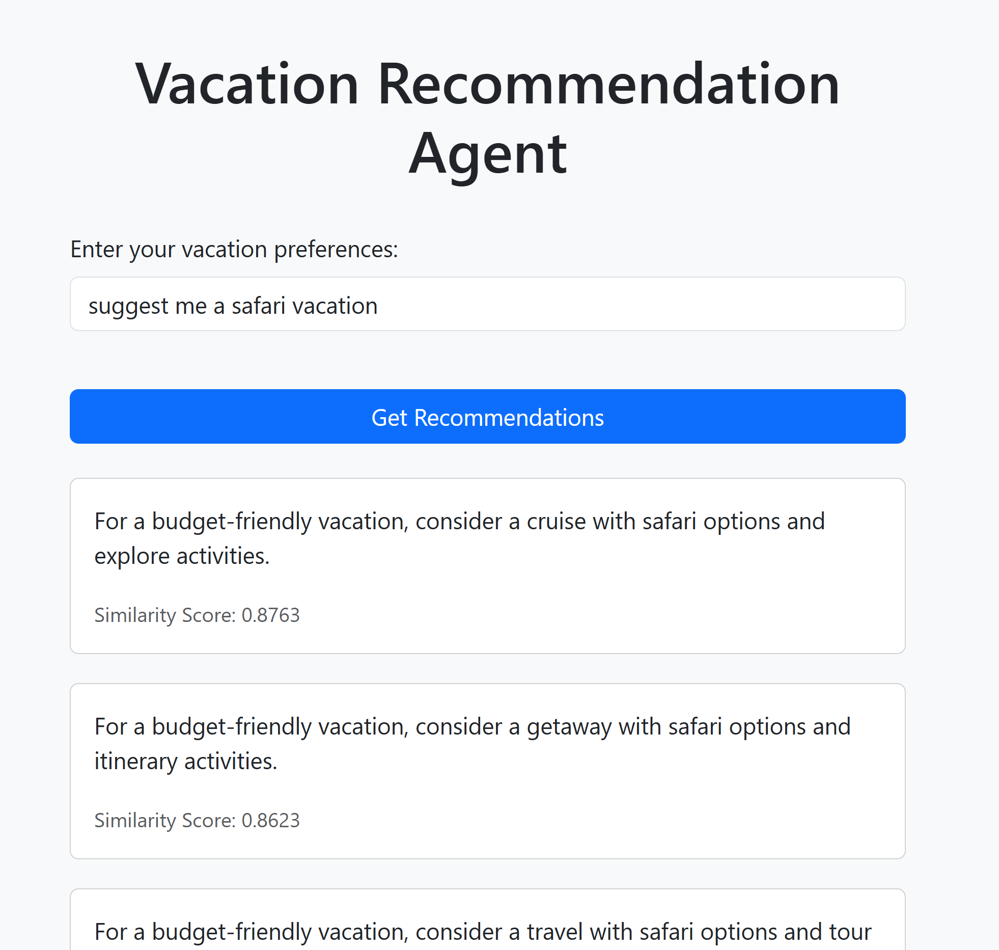

# Tourism Recommendation Agent

## Overview
The **Tourism Recommendation Agent** is an AI-powered system designed to provide travel recommendations based on user queries. It leverages **NVIDIA NeMo Framework** and **BERT embeddings** to generate relevant suggestions tailored to user preferences.

## Project Structure
### Explanation of Key Files and Their Roles
- `local_embeddings_deployment.ipynb` - BERT-based recommendation system.
- `index.html` - Frontend interface for user queries.

## Prerequisites
- Access to **Z by HP AI Studio**.
- A **GPU-enabled workspace** is required for efficient deployment.

## Installation Guide
### Step 1: Set Up AI Studio Project
1. Create a **New Project** in AI Studio.
2. Set the project type to **Team Mode**.
3. (Optional) Add a description and tags.
4. Click **Continue**.

### Step 2: Create a Workspace
1. Select **NeMo Framework** as the base image.
2. Name the workspace.
3. Click **Create Project**.

### Step 3: Organize Project Files
1. Upload all project files to the **shared folder** inside the workspace or clone the GitHub repo.
2. Create a `demo/` folder and add `index.html`.
3. Create a `data/` folder and add `CleanedData_Augmented.csv`.

## Running the Model
### Step 1: Generate Embeddings
- Run `02_WordEmbedding.ipynb` to generate `embedded_data.csv`.

### Step 2: Deploy the Service
1. Run `Local Embeddings Deployment.ipynb` to set up the deployment.
2. Navigate to **Deployments > Service**.
3. Name the service and select the **BERT_Similarity** model.
4. Choose the latest model version with **GPU configuration**.
5. Start the deployment.
6. Obtain the **service URL**.

## Model Details
### How the BERT Similarity Model Works
- Uses **BERT embeddings** to compute similarity between queries and dataset entries.
- Transforms text queries into vector representations and compares them against stored embeddings.
- Utilizes **MLflow** for model logging and retrieval.

## API Endpoints
### How the Frontend Interacts with the Backend
- The system exposes an `/invocations` API endpoint.
- The frontend sends a query request to this endpoint.
- The backend processes the request, retrieves the most relevant results, and sends a response.

## Testing & Using the Model
1. Open the **Swagger UI** from the deployment page.
2. Click the **link at the top** to open the **user-friendly interface**.
3. Enter a search query (e.g., "Give me a resort budget vacation suggestion").
4. Click **Get Recommendations** to view results.

## Screenshot of the User Interface

## Troubleshooting & Notes
- Monitor the output for errors during **model loading** or **document processing**.
- If deployment fails, restart the workspace and verify configurations.

## Additional Resources
- Refer to **[AI Studio Documentation](https://zdocs.datascience.hp.com/docs/aistudio/overview)** for further details.

